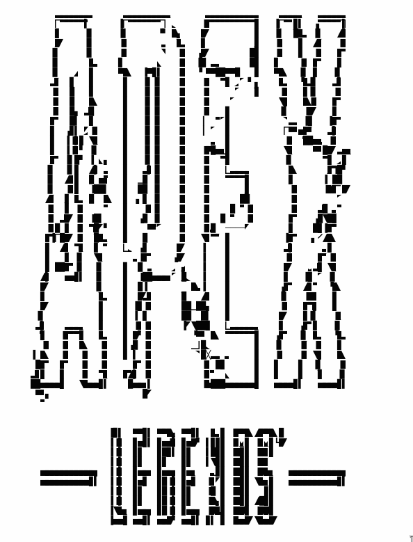
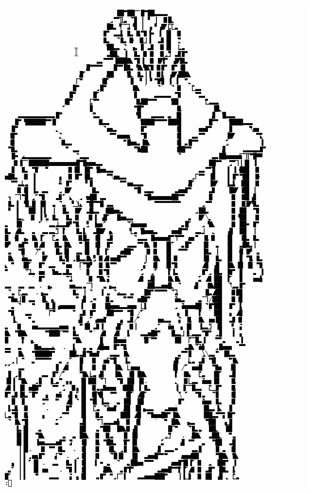
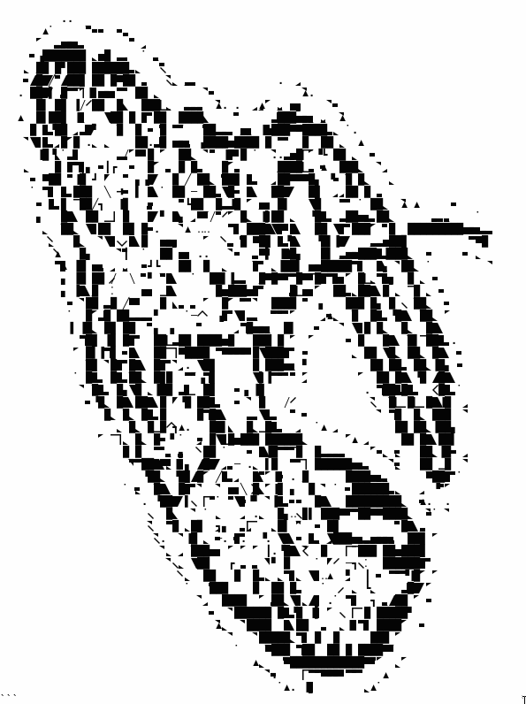

# png2linetext

Transform PNG to textual line art!

Images require pre-processing to come out nice. It's expected that users will do
the following:

1. Apply gaussian blur to remove noise and details.
2. Remove the color from the image.
3. Resize the image to 240px width (80 characters) and round the height to the
nearest number divisible by 3.
4. Apply an edge detection algorithm.
5. Invert the image to see the line art.
6. Run this program on the image.

Usage is simple: `png2linetext image.png`

If the width and height are not divisible by 3, the program will crash.

## Explanation

The program simply runs over the whole image, trying to match a "mask" and then
prints the corresponding matching character. Because the characters are chosen
to make lines stand out, the result should look better for line-oriented output.

This page was used to gather symbols to use for drawing:
https://en.wikipedia.org/wiki/Box-drawing_character .

## Examples

Becase web browsers are currently terrible at rendering the output as all
monospace, unlike terminals, the examples below have been included as images. If
you work for Google or Mozilla or Microsoft or Apple please fix this for the
love of god.

